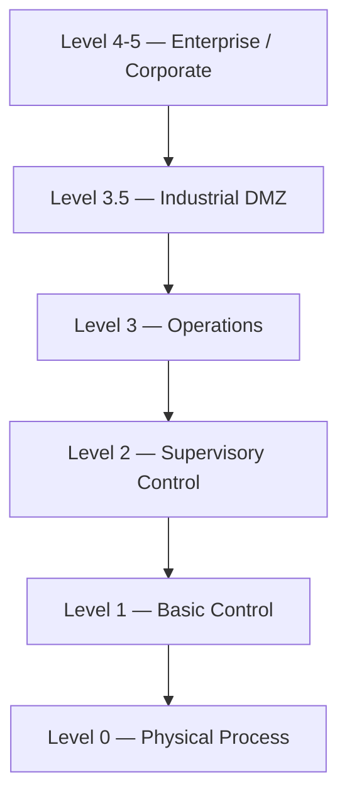
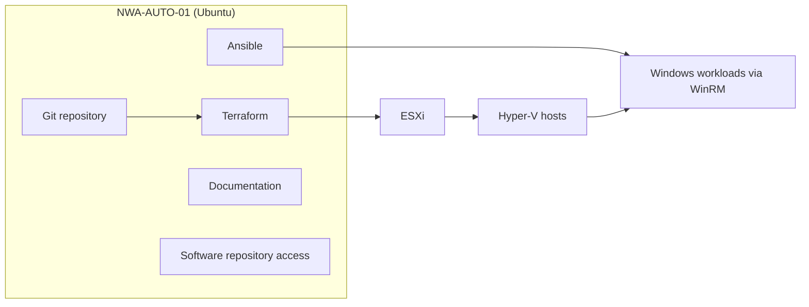

# OT Lab — Infrastructure as Code: Architecture

> **Project:** OT Cyber Security & Industrial Automation Laboratory
> **Approach:** Infrastructure as Code (Git → Terraform → Ansible)
> **Sites:** NWA (primary) · BAC (secondary)
> **Status:** Living document — last updated 2026-07-14

---

## 1. Objective

Build a complete OT (Operational Technology) cyber-security and industrial
automation laboratory that is fully reproducible from code. Both sites (**NWA**
and **BAC**) should ultimately be deployable end-to-end from version-controlled
source, following the ISA-95 / Purdue reference model for network segmentation.

The environment combines:

| Domain | Technologies |
| --- | --- |
| Virtualisation | VMware ESXi, Microsoft Hyper-V |
| Operating systems | Windows Server 2025, Windows 11 Pro, Ubuntu Linux |
| Industrial automation | Rockwell Automation Studio 5000, FactoryTalk suite |
| Network / security | Cisco (switching), FortiGate & OPSWAT (firewalls), EVE-NG (virtual network lab) |
| Automation & IaC | Terraform, Ansible, Git |

---

## 2. Purdue Model Overview

The architecture is segmented into the standard Purdue levels. Each site
maps its assets onto these levels.



| Level | Name | Role |
| --- | --- | --- |
| 4–5 | Enterprise / Corporate | Business network, WAN, corporate routing |
| 3.5 | Industrial DMZ | Secure boundary between IT and OT; remote access, patch relay |
| 3 | Operations | Site-wide OT servers: historian, AssetCentre, reporting, security tooling |
| 2 | Supervisory Control | SCADA servers, domain controllers, operator/engineering workstations |
| 1 | Basic Control | PLCs, safety controllers, remote I/O, gateways |
| 0 | Physical Process | Field devices, instrumentation, level indicators |

---

## 3. Automation Architecture

The primary automation host is **NWA-AUTO-01** (Ubuntu Linux). It is the single
control point for all Infrastructure-as-Code operations.



**NWA-AUTO-01 responsibilities**

- Ansible control node (Windows managed over WinRM)
- Terraform execution node (ESXi provisioning)
- Git repository / documentation repository
- Software repository access

### Ultimate deployment flow

```
Git → Terraform → ESXi → Hyper-V Hosts → Network Infrastructure
      (Cisco / FortiGate / OPSWAT) → Windows Servers → Rockwell Applications
      → Fully automated NWA / BAC OT environment
```

---

## 4. Site Topology

### 4.1 NWA (Main Site)

```
NWA
├── L4-5 Enterprise/Corporate
│   └── NWA-RTR-01
├── L3.5 Industrial DMZ
│   ├── NWA-DMZ-01
│   ├── NWA-FW-03 (FortiGate)
│   ├── NWA-SRA-01
│   └── NWA-VH-04
├── L3 Operations
│   ├── Infrastructure: NWA-FW-02 (FortiGate), NWA-SW-03, NWA-NTP-01, NWA-NAS-01, NWA-LDS-01
│   ├── Security:       NWA-IDS-01, NWA-IDS-02, NWA-EPP-01, NWA-SEM-01, NWA-NPM-01, NWA-NPM-02
│   ├── Applications:   NWA-HIST-01, NWA-ACS-01, NWA-REP-01
│   └── Hyper-V hosts:  NWA-VH-02, NWA-VH-03
├── L2 Supervisory Control
│   ├── Infrastructure: NWA-FW-01 (OPSWAT), NWA-SW-02, NWA-SW-01
│   ├── Hyper-V host:   NWA-VH-01
│   ├── VMs:            NWA-DC-01, NWA-SS-01
│   ├── Workstations:   NWA-EWS-01, NWA-OWS-01, NWA-OWS-02
│   └── Engineering:    NWA-PTR-01
├── L1 Basic Control
│   └── NWA-GW-01, NWA-PLC-01, NWA-SFT-01, NWA-RIO-01, NWA-RIO-02, NWA-UPS-01
└── L0 Physical Process
    └── NWA-FLC-01, NWA-LVI-01, NWA-LVI-02
```

### 4.2 BAC (Secondary Site)

```
BAC
├── L4-5 Enterprise/Corporate
│   └── BT WAN
├── L3 Operations
│   ├── Infrastructure: BAC-FW-02 (FortiGate), BAC-SW-05, BAC-NAS-01
│   ├── Security:       BAC-IDS-01, BAC-SEM-01
│   └── Hyper-V host:   BAC-VH-02
├── L2 Supervisory Control
│   ├── Infrastructure: BAC-FW-01 (OPSWAT), BAC-SW-04, BAC-SW-02
│   ├── Hyper-V host:   BAC-VH-01
│   ├── VMs:            BAC-DC-01, BAC-SS-01
│   └── Workstations:   BAC-OWS-01, BAC-OWS-02
├── L1 Basic Control
│   └── BAC-BRG-01..05, BAC-SW-01, BAC-SW-03, BAC-RIO-01..03, BAC-SFT-01, BAC-PLC-01..03, BAC-UPS-01
└── L0 Physical Process
    └── BAC-FLC-01
```

---

## 5. Compute Inventory

Sizing is taken from the current SCADA capacity plan. Storage and RAM are in GB.

### 5.1 Virtual Machines

| Functional Description | Host Name | OS | Hosted On | Cores | RAM | Storage |
| --- | --- | --- | --- | --: | --: | --: |
| SCADA Server | NWA-SS-01 | Windows Server 2025 | NWA-VH-01 | 12 | 32 | 99 |
| Active Directory | NWA-DC-01 | Windows Server 2025 | NWA-VH-01 | 2 | 8 | 99 |
| Asset Centre Server | NWA-ACS-01 | Windows Server 2025 | NWA-VH-02 | 2 | 8 | 99 |
| Historian Server | NWA-HIST-01 | Windows Server 2025 | NWA-VH-02 | 8 | 24 | 99 |
| Reporting Server | NWA-REP-01 | Windows Server 2025 | NWA-VH-02 | 8 | 24 | 99 |
| SCADA Client (OWS) | NWA-OWS-01 | Windows 11 Pro | — | 2 | 8 | 64 |
| SCADA Client (OWS) | NWA-OWS-02 | Windows 11 Pro | — | 2 | 8 | 64 |
| Engineering Workstation | NWA-EWS-01 | Windows 11 Pro | — | 2 | 8 | 64 |
| DMZ Workstation | NWA-DMZ-01 | Windows 11 Pro | — | 2 | 8 | 64 |
| SCADA Server | BAC-SS-01 | Windows Server 2025 | BAC-VH-01 | 12 | 32 | 99 |
| Active Directory | BAC-DC-01 | Windows Server 2025 | BAC-VH-01 | 2 | 8 | 99 |
| SCADA Client (OWS) | BAC-OWS-01 | Windows 11 Pro | — | 2 | 8 | 64 |
| SCADA Client (OWS) | BAC-OWS-02 | Windows 11 Pro | — | 2 | 8 | 64 |

### 5.2 Virtualisation Hosts

| Functional Description | Host Name | OS | Cores | RAM | Storage |
| --- | --- | --- | --: | --: | --: |
| NW SCADA Virtualisation Host | NWA-VH-01 | Windows Server 2025 | 14 | 40 | 198 |
| NW Auxiliary SCADA Virtualisation Host | NWA-VH-02 | Windows Server 2025 | 18 | 56 | 297 |
| NW Management Virtualisation Host | NWA-VH-03 | Windows Server 2025 | 2 | 8 | 99 |
| DMZ Virtualisation Host | NWA-VH-04 | Windows Server 2025 | 2 | 8 | 99 |
| BAC Virtualisation Host | BAC-VH-01 | Windows Server 2025 | 14 | 40 | 198 |
| BAC Management Virtualisation Host | BAC-VH-02 | Windows Server 2025 | 0 | 0 | 0 |

> **Totals (allocated):** 50 cores · 152 GB RAM · 891 GB storage.
> `BAC-VH-02` is defined but not yet provisioned (0/0/0).

---

## 6. Naming Convention

`<SITE>-<ROLE>-<NN>` — e.g. `NWA-EWS-01`, `BAC-OWS-01`, `NWA-HIST-01`.

| Code | Meaning | Code | Meaning |
| --- | --- | --- | --- |
| VH | Hyper-V Host | HIST | Historian |
| FW | Firewall | ACS | AssetCentre |
| SW | Switch | IDS | Intrusion Detection System |
| DC | Domain Controller | SEM | SIEM |
| EWS | Engineering Workstation | EPP | Endpoint Protection |
| OWS | Operator Workstation | SS | SCADA Server |

Additional roles seen in the topology: `RTR` (router), `SRA` (secure remote
access), `NTP` (time), `NAS` (storage), `LDS`, `NPM` (network performance
monitor), `PTR` (printer), `GW` (gateway), `PLC` (controller), `SFT` (safety),
`RIO` (remote I/O), `UPS`, `FLC`/`LVI` (field / level devices), `BRG` (bridge).

---

## 7. Ansible Inventory Groups

```ini
[hyperv_hosts]
nwa-vh-01
nwa-vh-02
nwa-vh-03
nwa-vh-04
bac-vh-01
bac-vh-02

[fortigate_firewalls]
nwa-fw-02
nwa-fw-03
bac-fw-02

[opswat_firewalls]
nwa-fw-01
bac-fw-01

[cisco_switches]
# nwa-sw-01 .. nwa-sw-03, bac-sw-01 .. bac-sw-05
```

### Repository layout

```
ansible/
├── inventory/
├── group_vars/
├── host_vars/
├── playbooks/
└── roles/
    ├── windows-base
    ├── hyperv
    ├── studio5000
    ├── active-directory
    ├── historian
    ├── assetcentre
    ├── cisco-switch
    ├── fortigate
    ├── opswat
    ├── ids
    ├── siem
    └── epp
```

---

## 8. Software Repository Strategy

| Phase | Location |
| --- | --- |
| Current lab | `\\vmware-host\Shared Folders\RA` (VMware Workstation shared folder) |
| Future production | `\\NWA-FILE-01\Software` or `\\BAC-FILE-01\Software` |

**Rule:** all playbooks reference the variable `rockwell_repo` — never a
hard-coded path — so the source can move without editing every role.

---

## 9. Software Installation Scope

The lab requires **multiple** software packages to be installed and configured
across the Windows estate (SCADA, historian, AssetCentre, engineering tooling,
security agents, etc.). These will each be automated as their own Ansible role
over time.

**Studio 5000 is the first package to be automated** — chosen as the starting
point to prove out the unattended-install pattern (media staging over WinRM,
UNC paths, silent switches, robocopy return-code handling). The same pattern
will be reused for the remaining packages.

### 9.1 Studio 5000 (first automated package)

**Current deployment:** Studio 5000 Logix Designer **v38.02**
**Media path:** `\\vmware-host\Shared Folders\RA\Studio5000\38.02.00-Studio5000-Web`

The web media ships as a self-extracting `part1.exe` plus `part2..part7.rar`
volumes. Extracted, it contains `38.02.00-Studio5000` and a bundled
`12.00.00-CompareTool` (LogixDesignerCompareToolSetup.msi + Data1.cab).

The installer XML identifies the package as `Product="Studio5000_V38.02"` and
installs the full stack:

- FactoryTalk Services Platform
- FactoryTalk Linx
- FactoryTalk Activation Manager
- ControlFLASH Plus
- Logix Designer
- View Designer
- Compare Tool
- Firmware Kits

> Because these components are installed **as part of Studio 5000**, separate
> Ansible roles are **not** required for FactoryTalk Linx, Activation Manager,
> or ControlFLASH.

### Validated unattended install

The correct silent command for this media is:

```
Setup.exe /QS /IAcceptAllLicenseTerms /AutoRestart
```

> ⚠️ **Do not** pass `/Product="Studio Enterprise"`. The installer help lists it
> as an example, but it does **not** work for this media — the product reports
> that it "does not support Install now." Omit the `/Product` parameter entirely.

See [`../ansible/playbooks/studio5000.yml`](../ansible/playbooks/studio5000.yml)
for the validated playbook.

---

## 10. Lessons Learned

| Area | Finding |
| --- | --- |
| VMware Shared Folders | `\\vmware-host\Shared Folders\RA` works as a temporary software repo |
| Drive mapping | Mapped drive letters (e.g. `X:`) are **not** reliable across WinRM sessions — prefer UNC paths |
| Robocopy | Exit codes 0–7 = success, 8+ = failure → `failed_when: copy_result.rc >= 8` |
| WinRM | Validated for file copy, PowerShell execution, software deployment, and long-running installs |

---

## 11. Roadmap

| Phase | Deliverable |
| --- | --- |
| 1 | Complete Studio 5000 role (first of several software packages) |
| 2 | Create Hyper-V role |
| 3 | Create Cisco switch automation |
| 4 | Create FortiGate automation |
| 5 | Deploy EVE-NG network lab |
| 6 | Terraform ESXi automation |
| 7 | Automated deployment of NWA environment |
| 8 | Automated deployment of BAC environment |

---

*This document is intended as the project's living "memory": a future engineer
or AI agent should be able to continue the build from this file alone. See
[`PROJECT_CONTEXT.md`](PROJECT_CONTEXT.md) for decisions, assumptions, and
continuity notes.*
