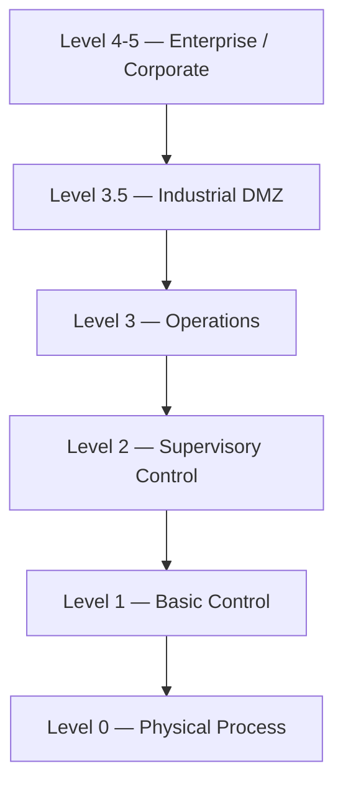
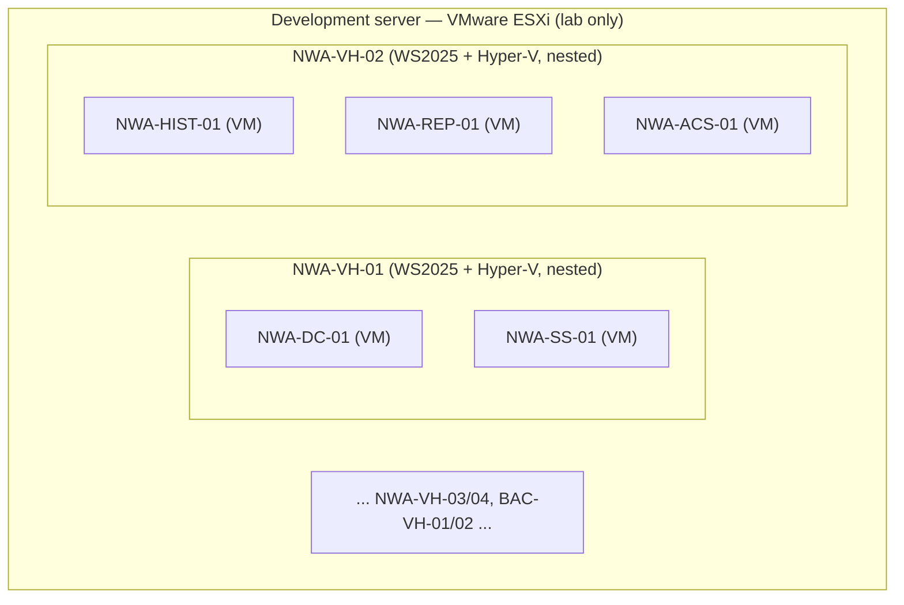
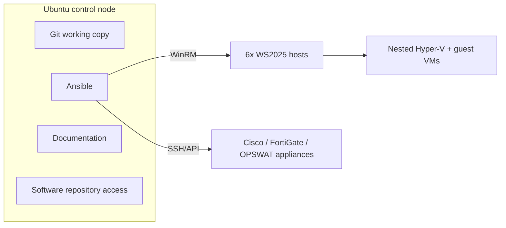

# OT Lab — Infrastructure as Code: Architecture

> **Project:** OT Cyber Security & Industrial Automation Laboratory
> **Approach:** Infrastructure as Code (Git → Terraform → Ansible)
> **Sites:** NWA (primary) · BAC (secondary)
> **Status:** Living document — last updated 2026-07-14

---

## 1. Objective

Build a complete OT (Operational Technology) cyber-security and industrial
automation laboratory that is fully reproducible from code. The lab is being
built **now, virtualised on a development ESXi server**, to stand in for **six
physical servers** that will arrive later. The whole point of doing it as
Infrastructure as Code is to make the eventual move from the virtual lab to the
real hardware as close to a no-op as possible.

The environment combines:

| Domain | Technologies |
| --- | --- |
| Virtualisation | VMware ESXi (lab base), Microsoft Hyper-V (on each server) |
| Operating systems | Windows Server 2025, Windows 11 Pro, Ubuntu Linux |
| Industrial automation | Rockwell Automation Studio 5000, FactoryTalk suite |
| Network / security | Cisco (switching), FortiGate & OPSWAT (firewalls), EVE-NG (virtual network lab) |
| Automation & IaC | Terraform, Ansible, Git |

---

## 2. Purdue Model Overview

The architecture is segmented into the standard Purdue levels. Each site maps
its assets onto these levels.



| Level | Name | Role |
| --- | --- | --- |
| 4–5 | Enterprise / Corporate | Business network, WAN, corporate routing |
| 3.5 | Industrial DMZ | Secure boundary between IT and OT; remote access, patch relay |
| 3 | Operations | Site-wide OT servers: historian, AssetCentre, reporting, security tooling |
| 2 | Supervisory Control | SCADA servers, domain controllers, operator/engineering workstations |
| 1 | Basic Control | PLCs, safety controllers, remote I/O, gateways |
| 0 | Physical Process | Field devices, instrumentation, level indicators |

---

## 3. Deployment Model — Reference (physical) vs Lab (ESXi nested)

The **logical architecture is identical** in both phases; only the bottom layer
(how the six "VH" servers exist) differs. This separation is the core design
goal: migrating from lab to production must change as little as possible.

### 3.1 Target (final hardware)

Six **physical servers** — one per dashed "host" box in the design diagram:

`NWA-VH-01`, `NWA-VH-02`, `NWA-VH-03`, `NWA-VH-04`, `BAC-VH-01`, `BAC-VH-02`.

Each physical server runs **Windows Server 2025 with the Hyper-V role
(bare-metal)**. The OT workloads run as **Hyper-V virtual machines inside** each
server.

### 3.2 Lab (current — development ESXi server)

One development server running **VMware ESXi**. On top of it we create **six
Windows Server 2025 VMs** that emulate the six physical servers. Each of those
VMs has **Hyper-V enabled (nested virtualisation)**, and the OT workload VMs run
inside that nested Hyper-V.



> In production, ESXi disappears and each `VH` box becomes a physical server.
> Everything **inside** a `VH` box stays exactly the same.

### 3.3 Two software layers

Software is installed at one of two layers, and roles are written accordingly:

| Layer | Where it runs | Examples |
| --- | --- | --- |
| **Host layer** | Directly on the Windows Server 2025 host (the `VH`) | Endpoint Protection (EPP), base OS hardening, Hyper-V role, monitoring/backup agents |
| **Guest layer** | Inside the Hyper-V VMs on that host | Domain Controller, SCADA, Historian, AssetCentre, Studio 5000, View Designer |

### 3.4 Network devices — virtual appliances (lab) vs physical (production)

The network layer follows the **same pattern** as the servers: physical at the
end, virtualised for the lab.

| Device role | Lab (now) | Production (final) |
| --- | --- | --- |
| FortiGate firewalls (`*-FW-02/03`) | FortiGate-VM appliance on ESXi | Physical FortiGate |
| OPSWAT firewalls (`*-FW-01`) | OPSWAT virtual appliance on ESXi | Physical OPSWAT |
| Cisco switches (`*-SW-*`) | Cisco VM (IOSv/CSR/Cat8000v, optionally in EVE-NG) | Physical Cisco |

In the lab, Purdue-level segmentation is realised with **ESXi port groups /
VLANs plus these appliance VMs**. Because Ansible configures the appliance by
role (rules, VLANs, NTP, SNMP, config backup), the same role applies whether the
target is a virtual appliance or the physical box — only the appliance's
management IP changes.

### 3.5 What changes between lab and production

| Layer | Lab (now) | Production (final) | Same roles? |
| --- | --- | --- | --- |
| Create the 6 `VH` machines | **Manual clone** of a WS2025 template on ESXi | Bare-metal install / imaging | ❌ only this layer changes |
| Create network appliances | Deploy virtual appliance VMs on ESXi | Rack physical devices | ❌ only this layer changes |
| Enable Hyper-V + host software | Ansible | Ansible | ✅ identical |
| Create & configure guest VMs | Ansible | Ansible | ✅ identical |
| Install app software in VMs | Ansible | Ansible | ✅ identical |
| Configure firewalls & switches | Ansible | Ansible | ✅ identical |

> **No Terraform.** VM creation is **not** automated in this project because API
> access to create VMs on the ESXi server is restricted. The six hosts are
> **cloned manually**; Ansible takes over from first boot. Terraform is kept only
> as an **optional future** step (see [`../terraform/README.md`](../terraform/README.md))
> if API-based provisioning ever becomes available — it does not block anything.

**Design rule:** keep the "create the machine" step (servers *and* appliances)
isolated from everything else, so swapping virtual for physical touches only that
one manual step.

---

## 4. Automation Architecture

The single automation host is an **Ubuntu Linux control node**. It is the only
machine with Ansible installed, and it drives everything else.



Ansible is **agentless**: nothing is permanently installed on the targets. The
control node opens a connection (WinRM for Windows, SSH/API for network gear),
pushes the change, and disconnects.

**Control-node responsibilities**

- Ansible control node (Windows over WinRM; network appliances over SSH/API)
- Git working copy of this repository
- Documentation and software-repository access

### Deployment flow (current, no Terraform)

```
Manual clone: 6x WS2025 hosts + appliance VMs on ESXi
    → Ansible: enable Hyper-V + host software (EPP)
    → Ansible: create guest VMs
    → Ansible: install Windows/Rockwell software in the VMs
    → Ansible: configure Cisco / FortiGate / OPSWAT
    → Fully automated NWA / BAC OT environment
```

---

## 5. Site Topology

Component names and grouping are taken from the design diagram (BPA/BNW SCADA
sheets 4 & 5). Location/zone codes from the diagram are intentionally omitted
here.

### 5.1 NWA (Main Site)

```
NWA
├── L4-5 Enterprise/Corporate
│   ├── NWA-RTR-01 (router)
│   └── Corporate WAN / BT WAN / Internet
├── L3.5 Industrial DMZ
│   ├── NWA-DMZ-01  (guest VM on NWA-VH-04)
│   ├── NWA-VH-04   (host)
│   ├── NWA-FW-03   (FortiGate, deep packet inspection)
│   └── NWA-SRA-01  (secure remote access)
├── L3 Operations
│   ├── Infrastructure: NWA-GW-02, NWA-FW-02 (FortiGate), NWA-SW-03, NWA-NTP-01, NWA-NAS-01, NWA-VRU-01, NWA-LDS-01
│   ├── Security (on NWA-VH-03): NWA-IDS-01, NWA-IDS-02, NWA-EPP-01, NWA-SEM-01, NWA-NPM-01, NWA-NPM-02
│   ├── Applications (on NWA-VH-02): NWA-HIST-01, NWA-ACS-01, NWA-REP-01
│   └── Hosts: NWA-VH-02, NWA-VH-03
├── L2 Supervisory Control
│   ├── Infrastructure: NWA-FW-01 (OPSWAT, DPI), NWA-SW-02, NWA-SW-01
│   ├── Host: NWA-VH-01
│   ├── Guest VMs (on NWA-VH-01): NWA-DC-01, NWA-SS-01
│   ├── Workstations: NWA-EWS-01, NWA-OWS-01, NWA-OWS-02
│   └── Engineering: NWA-PTR-01 (printer)
├── L1 Basic Control
│   └── NWA-GW-01, NWA-PLC-01, NWA-SFT-01, NWA-RIO-01, NWA-RIO-02, NWA-UPS-01
└── L0 Physical Process
    └── NWA-FLC-01, NWA-LVL-01, NWA-LVL-02
```

### 5.2 BAC (Secondary Site)

```
BAC
├── L4-5 Enterprise/Corporate
│   └── BT WAN (cross-links to NWA)
├── L3 Operations
│   ├── Infrastructure: BAC-FW-02 (FortiGate), BAC-SW-05, BAC-NAS-01
│   ├── Security (on BAC-VH-02): BAC-IDS-01, BAC-SEM-01
│   └── Host: BAC-VH-02
├── L2 Supervisory Control
│   ├── Infrastructure: BAC-FW-01 (OPSWAT, DPI), BAC-SW-04
│   ├── Host: BAC-VH-01
│   ├── Guest VMs (on BAC-VH-01): BAC-DC-01, BAC-SS-01
│   └── Workstations: BAC-OWS-01, BAC-OWS-02
├── L1 Basic Control
│   └── BAC-BRG-01..05, BAC-SW-01, BAC-SW-02, BAC-SW-03, BAC-RIO-01..03, BAC-SFT-01, BAC-PLC-01..03, BAC-UPS-01
└── L0 Physical Process
    └── BAC-FLC-01
```

> **To confirm:** the diagram places `BAC-SW-02` in L1 (`+BAC.LVPS`); an earlier
> note had it in L2. Listed under L1 here to match the diagram.

---

## 6. Compute Inventory

Sizing is taken from the current SCADA capacity plan. Storage and RAM are in GB.
The six **Virtualisation Hosts** are the six machines that are physical in
production and WS2025-on-ESXi in the lab.

### 6.1 Guest VMs (run inside Hyper-V)

| Functional Description | Host Name | OS | Runs On (host) | Cores | RAM | Storage |
| --- | --- | --- | --- | --: | --: | --: |
| SCADA Server | NWA-SS-01 | Windows Server 2025 | NWA-VH-01 | 12 | 32 | 99 |
| Active Directory | NWA-DC-01 | Windows Server 2025 | NWA-VH-01 | 2 | 8 | 99 |
| Asset Centre Server | NWA-ACS-01 | Windows Server 2025 | NWA-VH-02 | 2 | 8 | 99 |
| Historian Server | NWA-HIST-01 | Windows Server 2025 | NWA-VH-02 | 8 | 24 | 99 |
| Reporting Server | NWA-REP-01 | Windows Server 2025 | NWA-VH-02 | 8 | 24 | 99 |
| SCADA Client (OWS) | NWA-OWS-01 | Windows 11 Pro | — | 2 | 8 | 64 |
| SCADA Client (OWS) | NWA-OWS-02 | Windows 11 Pro | — | 2 | 8 | 64 |
| Engineering Workstation | NWA-EWS-01 | Windows 11 Pro | — | 2 | 8 | 64 |
| DMZ Workstation | NWA-DMZ-01 | Windows 11 Pro | NWA-VH-04 | 2 | 8 | 64 |
| SCADA Server | BAC-SS-01 | Windows Server 2025 | BAC-VH-01 | 12 | 32 | 99 |
| Active Directory | BAC-DC-01 | Windows Server 2025 | BAC-VH-01 | 2 | 8 | 99 |
| SCADA Client (OWS) | BAC-OWS-01 | Windows 11 Pro | — | 2 | 8 | 64 |
| SCADA Client (OWS) | BAC-OWS-02 | Windows 11 Pro | — | 2 | 8 | 64 |

### 6.2 Virtualisation Hosts (the six "VH" machines)

| Functional Description | Host Name | OS | Cores | RAM | Storage |
| --- | --- | --- | --: | --: | --: |
| NW SCADA Virtualisation Host | NWA-VH-01 | Windows Server 2025 | 14 | 40 | 198 |
| NW Auxiliary SCADA Virtualisation Host | NWA-VH-02 | Windows Server 2025 | 18 | 56 | 297 |
| NW Management Virtualisation Host | NWA-VH-03 | Windows Server 2025 | 2 | 8 | 99 |
| DMZ Virtualisation Host | NWA-VH-04 | Windows Server 2025 | 2 | 8 | 99 |
| BAC Virtualisation Host | BAC-VH-01 | Windows Server 2025 | 14 | 40 | 198 |
| BAC Management Virtualisation Host | BAC-VH-02 | Windows Server 2025 | 0 | 0 | 0 |

> **Totals (allocated):** 50 cores · 152 GB RAM · 891 GB storage.
> `BAC-VH-02` exists in the design (it hosts `BAC-IDS-01` / `BAC-SEM-01`) but is
> not yet sized in the capacity plan (0/0/0 — **TBD**).

---

## 7. Naming Convention

`<SITE>-<ROLE>-<NN>` — e.g. `NWA-EWS-01`, `BAC-OWS-01`, `NWA-HIST-01`.

| Code | Meaning | Code | Meaning |
| --- | --- | --- | --- |
| VH | Hyper-V Host | HIST | Historian |
| FW | Firewall | ACS | AssetCentre |
| SW | Switch | IDS | Intrusion Detection System |
| DC | Domain Controller | SEM | SIEM |
| EWS | Engineering Workstation | EPP | Endpoint Protection |
| OWS | Operator Workstation | SS | SCADA Server |

Additional roles seen in the topology: `RTR` (router), `GW` (gateway),
`SRA` (secure remote access), `NTP` (time), `NAS` (storage), `VRU`, `LDS`,
`NPM` (network performance monitor), `PTR` (printer), `PLC` (controller),
`SFT` (safety), `RIO` (remote I/O), `UPS`, `FLC`/`LVL` (field / level devices),
`BRG` (bridge). Field/safety layers may also include `ESD` (emergency shutdown
system) and `IO Rack` devices per the diagram legend.

---

## 8. Ansible Inventory Groups

```ini
[hyperv_hosts]
nwa-vh-01
nwa-vh-02
nwa-vh-03
nwa-vh-04
bac-vh-01
bac-vh-02

[fortigate_firewalls]
nwa-fw-02
nwa-fw-03
bac-fw-02

[opswat_firewalls]
nwa-fw-01
bac-fw-01

[cisco_switches]
# nwa-sw-01 .. nwa-sw-03, bac-sw-01 .. bac-sw-05
```

### Repository layout

```
ansible/
├── inventory/
├── group_vars/
├── host_vars/
├── playbooks/
└── roles/
    ├── windows-base        # host + guest base config
    ├── hyperv              # enable Hyper-V role, define switches, create guest VMs
    ├── studio5000          # first software package (see §10)
    ├── active-directory
    ├── historian
    ├── assetcentre
    ├── cisco-switch
    ├── fortigate
    ├── opswat
    ├── ids
    ├── siem
    └── epp                 # endpoint protection — installed on the HOST layer
```

---

## 9. Software Repository Strategy

| Phase | Location |
| --- | --- |
| Current lab | `\\vmware-host\Shared Folders\RA` (VMware Workstation shared folder) |
| Future production | `\\NWA-FILE-01\Software` or `\\BAC-FILE-01\Software` |

**Rule:** all playbooks reference the variable `rockwell_repo` — never a
hard-coded path — so the source can move without editing every role.

---

## 10. Software Installation Scope

The lab requires **multiple** software packages across the Windows estate. Each
is automated as its own Ansible role, and each targets either the **host layer**
or the **guest layer** (see §3.3):

- **Host layer** (on the WS2025 `VH`): Hyper-V role, Endpoint Protection (EPP),
  base hardening, monitoring/backup agents.
- **Guest layer** (inside the VMs): Active Directory, SCADA, Historian,
  AssetCentre, Studio 5000, View Designer, IDS/SIEM sensors, etc.

**Studio 5000 is the first package to be automated** — chosen to prove out the
unattended-install pattern (media staging over WinRM, UNC paths, silent
switches, robocopy return-code handling). The same pattern is reused for the
rest.

### 10.1 Studio 5000 (first automated package)

**Current deployment:** Studio 5000 Logix Designer **v38.02**
**Media path:** `\\vmware-host\Shared Folders\RA\Studio5000\38.02.00-Studio5000-Web`

The web media ships as a self-extracting `part1.exe` plus `part2..part7.rar`
volumes. Extracted, it contains `38.02.00-Studio5000` and a bundled
`12.00.00-CompareTool`.

The installer XML identifies the package as `Product="Studio5000_V38.02"` and
installs the full stack:

- FactoryTalk Services Platform
- FactoryTalk Linx
- FactoryTalk Activation Manager
- ControlFLASH Plus
- Logix Designer
- View Designer
- Compare Tool
- Firmware Kits

> Because these components install **as part of Studio 5000**, separate Ansible
> roles are **not** required for FactoryTalk Linx, Activation Manager, or
> ControlFLASH.

### Validated unattended install

```
Setup.exe /QS /IAcceptAllLicenseTerms /AutoRestart
```

> ⚠️ **Do not** pass `/Product="Studio Enterprise"`. The installer help lists it
> as an example, but it does **not** work for this media — the product reports
> that it "does not support Install now." Omit the `/Product` parameter entirely.

See [`../ansible/playbooks/studio5000.yml`](../ansible/playbooks/studio5000.yml)
for the validated playbook.

---

## 11. Lessons Learned

| Area | Finding |
| --- | --- |
| VMware Shared Folders | `\\vmware-host\Shared Folders\RA` works as a temporary software repo |
| Drive mapping | Mapped drive letters (e.g. `X:`) are **not** reliable across WinRM sessions — prefer UNC paths |
| Robocopy | Exit codes 0–7 = success, 8+ = failure → `failed_when: copy_result.rc >= 8` |
| WinRM | Validated for file copy, PowerShell execution, software deployment, and long-running installs |
| Nested virtualisation | Hyper-V inside an ESXi VM requires "Expose hardware assisted virtualization" on the VM; keep the "create VH" step isolated so physical migration is trivial |

---

## 12. Roadmap

| Phase | Deliverable |
| --- | --- |
| 1 | Complete Studio 5000 role (first of several software packages) |
| 2 | Create Hyper-V role (host layer: enable role, virtual switches, create guest VMs) |
| 3 | Create Cisco switch automation |
| 4 | Create FortiGate automation |
| 5 | Deploy EVE-NG network lab |
| 6 | *(Optional / future)* Terraform to provision the 6 hosts on ESXi — only if API access is granted; not required |
| 7 | Automated deployment of NWA environment |
| 8 | Automated deployment of BAC environment |

---

*This document is intended as the project's living "memory": a future engineer
or AI agent should be able to continue the build from this file alone. See
[`PROJECT_CONTEXT.md`](PROJECT_CONTEXT.md) for decisions, assumptions, and
continuity notes.*
