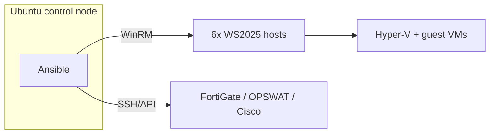

# OT Lab — Team Overview

A one-page briefing for the team: what this project is, why it is built the way
it is, and how the pieces fit together. For full detail see
[`ARCHITECTURE.md`](ARCHITECTURE.md); for hands-on setup see
[`GETTING_STARTED.md`](GETTING_STARTED.md).

---

## What we are building

A complete **OT (Operational Technology) cyber-security and industrial
automation lab** for two sites — **NWA** (primary) and **BAC** (secondary) —
described entirely as **Infrastructure as Code**. Everything (servers, Windows
roles, Rockwell software, firewalls, switches) is defined in version-controlled
files so the environment can be rebuilt consistently and reviewed like code.

## Why Infrastructure as Code

Six **physical servers** are coming. Rather than wait, we build and validate the
whole system **now, virtualised**, so that when the hardware arrives the move is
as close to a no-op as possible. The design deliberately isolates the one thing
that will change (how the machines are created) from everything else (how they
are configured), which stays identical.

## The two phases

| | Now (lab) | Final (production) |
| --- | --- | --- |
| Servers (the six `VH`) | 6 Windows Server 2025 VMs on one **ESXi** dev server, with **nested Hyper-V** | 6 **physical** servers running Hyper-V |
| Network (firewalls/switches) | **Virtual appliances** (FortiGate-VM, OPSWAT-VM, Cisco-VM) | **Physical** devices |
| Everything else | Configured by **Ansible** | Configured by the **same Ansible** |

> Only the "create the machine" step differs between the two columns. That is the
> whole point.

## How it works

- A single **Ubuntu machine** runs **Ansible** and drives everything.
- Ansible is **agentless** — it connects, applies the change, and disconnects;
  nothing is permanently installed on the targets.
- Windows hosts and VMs are reached over **WinRM**; network appliances over
  **SSH/API**.
- We do **not** use Terraform (VM-creation API access is restricted): the six
  hosts are **cloned manually**, then Ansible takes over.

## Two layers of software

- **Host layer** — installed directly on each Windows Server 2025 host:
  Hyper-V role, Endpoint Protection (EPP), base hardening, agents.
- **Guest layer** — installed inside the Hyper-V VMs: Active Directory, SCADA,
  Historian, AssetCentre, **Studio 5000**, View Designer, security sensors.

## Structure of the repo

Everything is organised **by role** so work can be split and reviewed cleanly:

| Area | Roles |
| --- | --- |
| Host | `windows-base`, `hyperv`, `epp` |
| Guest apps | `active-directory`, `studio5000`, `historian`, `assetcentre` |
| Network | `cisco-switch`, `fortigate`, `opswat` |
| Security | `ids`, `siem` |

## Where we are

- ✅ Architecture, inventory, naming, and deployment model documented.
- ✅ First software install (**Studio 5000 v38.02**) validated end-to-end.
- ⏳ Next: build the `hyperv` host role, then extend to the remaining roles.

See the full roadmap in [`ARCHITECTURE.md`](ARCHITECTURE.md#12-roadmap).
